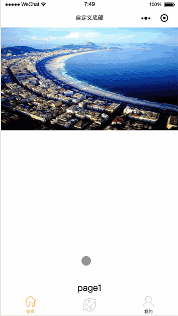
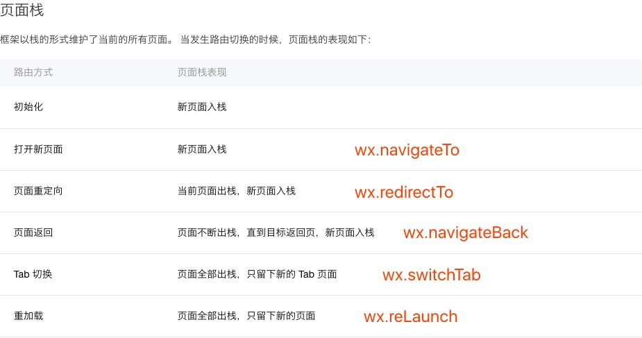

# miniprogram-custom-bottom
微信小程序自定义底部导航栏（原生语法）

## 效果预览图

## 起步

底部导航栏的作用实际是切换各个Tab页面的。小程序实际上是可以通过简单的配置实现一个这样的东西。但是简单配置实现的样式过于死板，只支持汉字和图片（两者都是必须的），如下图所示。

可以和最上面的效果预览图比较，我这边只是把中间tab-item的文字给去掉了把图标调大，其实想怎么设计完全取决于你的想象力。原生的导航栏不计入dom节点中的，自定义的话是dom中的节点。这就为我们个性化导航栏提供了可能。

## 实现思路

首先我们先了解下微信的路由api和微信的路由机制，微信一共提供了5个路由api：`wx.navigateTo`、`wx.redirectTo`、`wx.switchTab`、`wx.navigateBack`、`wx.reLaunch`，具体文档位于[https://developers.weixin.qq.com/miniprogram/dev/api/ui-navigate.html](https://developers.weixin.qq.com/miniprogram/dev/api/ui-navigate.html)。

微信小程序有一个页面栈的东西，他最多容纳5个元素，元素的值就是页面在app.json中配置的path值。

前面提到过，导航栏的作用就是切换路由，原生使用`wx.switchTab`方法进行切换，这个也作为我们的首选，因为他的交互是最符合习惯的。那使用他的前提是我们需要在`app.json`文件中配置`tabBar`属性，而只要一配置了`tabBar`属性，系统原生的导航栏就出现了，幸好微信有一个隐藏原生导航栏的api：[wx.hideTabBar](https://developers.weixin.qq.com/miniprogram/dev/api/ui-tabbar.html#wxhidetabbarobject)。看到这里相信聪明的你已经知道了实现思路，就是隐藏掉原生的然后自己去实现一个导航栏贴在最下面。

光说不干假把式，上代码~

导航栏实现

	tabbar.wxml
	<template name='tabbar'>
	  <view class='com-tabbar'>
	    <view bindtap='handleSwitchRouter' data-url='{{item.pagePath}}' class='com-tabbar-item {{item.active?"com-tabbar-item_active":""}}'  wx:for="{{tabbarConfig}}" wx:key="item.pagePath">
	      <image class='com-tabbar-icon {{index === 1?"com-tabbar-icon-super":""}}' src='{{item.active?item.selectedIconPath:item.iconPath}}'></image>
	      <view wx:if='{{index !== 1}}' class='com-tabbar-text'>{{item.text}}</view>
	    </view>
	  </view>
	</template>

	tabbar.js
	const app = getApp()
	export default {
	  handleSwitchRouter(event) {
	    let path = event.currentTarget.dataset.url
	    app.globalData.tabbarConfig.forEach((item) => {
	      item.active = item.pagePath === path ? true : false
	    })
	    wx.switchTab({
	      url: '/' + path,
	    })
	  }
	} 

app.js

	App({
	  onLaunch: function () {
	  },
	  // 小程序的全局变量
	  // 用他来管理全局的路由
	  globalData: {
	  // tabbarConfig 里面的内容可以copy app.json中tabbar的配置
	    tabbarConfig: [
	      {
	        "active": true, // active是这里独有的，通过它可以判断哪个页面是当前的tab页
	        "pagePath": "pages/index/index",
	        "text": "首页",
	        "iconPath": "/icon/home_nor.png",
	        "selectedIconPath": "/icon/home_pre.png"
	      },
	      {
	        "active": false,
	        "pagePath": "pages/center/index",
	        "text": "发现",
	        "iconPath": "/icon/center_nor.png",
	        "selectedIconPath": "/icon/center_pre.png"
	      },
	      {
	        "active": false,
	        "pagePath": "pages/mine/index",
	        "text": "我的",
	        "iconPath": "/icon/mine_nor.png",
	        "selectedIconPath": "/icon/mine_pre.png"
	      }
	    ],
	    isHideTabbar: false
	  }
	})
	
主页（小程序一进来的页面）的js

	// 获取app实例，里面有app.js定义的各个对象
	const app = getApp()
	// 将公共方法提取出来
	import { setRouterConfig } from '../../utils/util.js'
	// 将底部导航栏用template方式实现，并把其api引入进来
	// 此处是因为小程序对于组件化开发的支持实在太弱了
	// 可以考虑下小程序的开发框架: wepy、mpvue
	import tabbarApi from '../components/tabbar/tabbar'
	// 定义页面自己的js逻辑
	const selfApi = {
	  // 虽然我们使用了全局变量存储状态，但是他不是响应式的
	  // 所以要在本地data中copy一个副本
	  data: {
	    tabbarConfig: app.globalData.tabbarConfig,
	    isHideTabbar: app.globalData.isHideTabbar
	  },
	  onLoad: function () {
	    // 调用hideTabBar方法
	    wx.hideTabBar({
	      success: () => {
	        // 如果成功就将全局的状态修改，此处主要是防止调用失败后出现两个导航栏
	        app.globalData.isHideTabbar = true
	        this.setData({
	          isHideTabbar: app.globalData.isHideTabbar
	        })
	      }
	    })
	    // 获取当前页面路由
	    let path = this.route
	    this.setData({
	      tabbarConfig: setRouterConfig(app.globalData.tabbarConfig, path)
	    })
	  }
	}
	Page(Object.assign({}, tabbarApi, selfApi))
	
在各个tab页面上使用主要是通过这两行代码

	<import src="/pages/components/tabbar/tabbar" />
	<template wx:if='{{isHideTabbar}}' is='tabbar' data="{{tabbarConfig}}"/>
	
## 总结

已经工作24小时头昏脑热的写这个文档，再加上本来表达能力就不好，可能写的不好，如果大家对实现有什么疑问可以给我提issue，如果大家有更好的实现方式也可以联系我，或者在小程序中有什么开发的心得和疑惑也可以和我交流。

> [小程序爬坑总结](https://ljybill.github.io/2017/08/30/%E5%B0%8F%E7%A8%8B%E5%BA%8F%E7%88%AC%E5%9D%91%E6%97%A5%E8%AE%B0/)

## TODO

研究下mpvue开发小程序