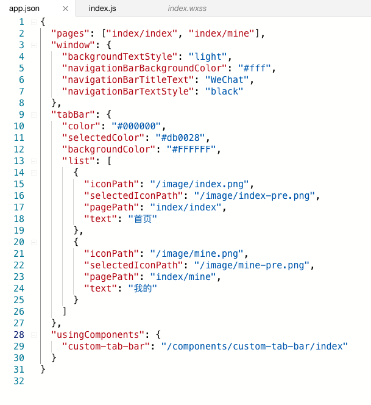
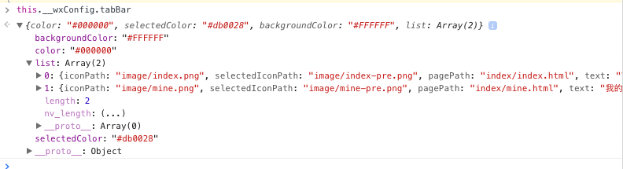
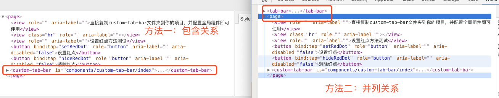
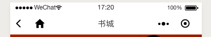

# 小程序自定义tabBar再探索

## 19年9月7日更新日志

在微信客户端`7.0.5`版本，小程序基础库版本2.8.0+中，__wxConfig.tabBar.list.item这个对象，不再包含iconPath和selectedIconPage字段，之前的代码实现中，是依赖这两个字段的，所以可能引起问题：图标不显示，解决方案：

1. 可以在app.json tabbar中增加自定义字段
2. 可以在自定义底部导航栏代码中写死路由信息，或者增加一个js配置文件。

我觉得出现了这样的问题，是因为之前过于信任__wxConfig中的值了，所以推荐使用第二种解决方案，增加一个js配置文件去管理自定义导航栏中的路由信息，需要注意：**以后更新的时候，app.json和config.js文件要同步更新！**

## 19年3月28日更新日志

更新代码片段，增加中间独占icon显示效果

## 前言

最近有很多微信开发者朋友在QQ上加我好友，忽然意识到大家对微信自定义底部导航栏需求还是挺大的，故而再次整理下底部导航栏组件开发思路。和之前的文章还是有些区别，并且底部导航栏组件增加新的特性以及一些优化开发体验的骚操作。

## 技术选型

与之前不同，现在我们有两种方法实现自定义底部导航栏，因为**小程序在2.5.0开始支持自定义底部导航栏了**[戳此处看文档](https://developers.weixin.qq.com/miniprogram/dev/framework/ability/custom-tabbar.html)，所以我们现在的可选方案为：

- 通过`HideTabBar`接口hack底部导航栏
- 通过小程序支持配置实现底部导航栏

下面根据两种方式都讲讲

## 通过`HideTabBar`接口hack底部导航栏

### 实现思路

首先我们先了解下微信的路由api和微信的路由机制，微信一共提供了5个路由api：`wx.navigateTo`、`wx.redirectTo`、`wx.switchTab`、`wx.navigateBack`、`wx.reLaunch`，具体文档位于[https://developers.weixin.qq.com/miniprogram/dev/api/ui-navigate.html](https://developers.weixin.qq.com/miniprogram/dev/api/ui-navigate.html)。

其中我们用哪个呢？很显然`wx.switchTab`很合我们的口味，因为他的切换效果是没有推入推出动画的，更符合我们的习惯，那使用他的前提是我们需要在`app.json`文件中配置`tabBar`属性，而只要一配置了`tabBar`属性，系统原生的导航栏就出现了，幸好微信有一个隐藏原生导航栏的api：[wx.hideTabBar](https://developers.weixin.qq.com/miniprogram/dev/api/ui-tabbar.html#wxhidetabbarobject)。看到这里相信聪明的同学已经知道了实现思路，就是隐藏掉原生的然后自己去实现一个导航栏贴在最下面。

### 使用方法

源码地址

- [微信小程序代码片段](https://developers.weixin.qq.com/s/v1dBsdmn7i7C)

本次代码**拷贝之后可以直接使用**，具体操作如下

1. 复制components/custom-tab-bar文件夹到你的项目
2. 在app.json中设置`usingComponents`对象
3. 在tab页面的wxml最后追加`<custom-tab-bar></custom-tab-bar>`

即可观察效果

### 支持的特性

- 无需额外配置，甚至不用传参，自动读取`app.json`中`tabBar`的配置
- 使用`wx.showTabBarRedDot`方法可以设置红点
- 可以自定义样式，摆脱微信限制（如borderStyle仅支持black/white的限制）
- 可以定制个性化逻辑
- **兼容iphoneX,底部自动留空**

### 关键代码介绍

#### tabBar配置的获取

看过之间博客的同学知道，之前是需要一个额外的route.js文件的，来获取tabBar的配置，原因是小程序js无法读取json文件。随着知（sao）识（cao zuo）掌握增多，发现了更加方便的办法：我们可以通过`__wxConfig`全局对象的`tabBar`属性去查看`app.json`设置。所以我们在组件中直接这样定义：

	const fixListConfig = function(item, index) {
	  const result = {}; // 使用新对象，类似浅拷贝
	  result.pagePath = "/" + item.pagePath.replace(/.html$/g, "");
	  result.iconPath = item.iconData
	    ? "data:image/png;base64," + item.iconData
	    : "/" + item.iconPath;
	  result.selectedIconPath = item.selectedIconData
	    ? "data:image/png;base64," + item.selectedIconData
	    : "/" + item.selectedIconPath;
	  result.idx = index;
	  result.redDot = false;
	  result.text = item.text;
	  return result;
	};	
	const _tabBar = __wxConfig.tabBar;
	
	Component({
	  data: {
	    activeIdx: -1,
	    config: _tabBar,
	    list: _tabBar.list.map(fixListConfig)
	  },
	});

其中`list`就是我们tab页面列表，`tabBar`里面还包括了我们定义的一些样式，比如`selectColor`之类的，因为格式并不是直接拿来就能用，所以我们用map对数据进行了修改和浅拷贝。

此处还有一个坑，部分真机上小程序配置中的图标会变成base64格式的，所以需要做兼容。

上面代码不是难点，关键在于`__wxConfig`对象，大家可以在微信开发工具控制台执行`this.__wxConfig`看看里面的内容，相信能对你有所启发。

#### 当前页的判断

相信大家都用过`getCurrentPages()`这个全局函数，我们也是通过它来获取当前页面的路由然后将其标记为`active`状态。本着自己的事情自己做的原则，我利用自定义组件的`pageLifetimes`功能，实现了内部判断当前页，具体代码如下：

	pageLifetimes: {
		show() {
		  const pages = getCurrentPages();
		  const page = pages[pages.length - 1];
		  const route = page.__route__;
		  const idx = this.data.list.find(item => item.pagePath === `/${route}`)
		    .idx;
		  if (this.data.activeIdx !== idx) {
		    this.setData({
		      activeIdx: idx
		    });
		  }
		}
	}
	
注意`pageLifetimes`特性在基础库2.2.3以上支持，目前没什么问题，其实外面传值写死也是ok的，毕竟每个页面是一个单独的组件。

#### 使用css兼容iPhone X(**强烈建议了解**)

此处一需一行代码
	
	.tab-bar{
		padding-bottom: env(safe-area-inset-bottom);
	}

这个方法不光可用于小程序，也可用于移动端，网上有很多介绍他的文章，比如[网页适配 iPhoneX，就是这么简单](https://aotu.io/notes/2017/11/27/iphonex/index.html)

#### 修改wx接口注入自己的代码逻辑

上面特性中提到了，我们可以使用`wx.showTabBarRedDot`方法设置我们的redDot，也可以打开上面的小程序微码查看效果。这个是利用`Object.defineProperty`方法实现的，具体代码可以看`custom-tab-bar/extraFun.js`文件查看。这块就不再详述了，大家想了解的可以直接阅读源码，如果有疑问可以单独联系我。

## 通过小程序支持配置实现底部导航栏

现在，我们来聊聊**为什么不用**小程序支持的配置方法实现底部导航栏。

### 使用方法

现在我们根据文档进行改造，在`app.json`的`tabBar`对象中增加`"custom":true`，并在**根目录**下增加`custom-tab-bar/index`组件。之后的开发就和上面差不多了，我们写组件实现期望的效果。

### 两者的区别

为了描述方便，我们将之前提到的方法称为方法一，小程序配置的称之为方法二。方法一的组件是在page里面的，方法二的组件是和page并列的关系，如图所示：

这个对我们有什么影响吗，就我目前观察，有几个问题

- 某些情况下会引起bug，当我们打开一个非tab页面的时候，还是会显示底部导航栏。（最严重问题，会有bug）
- 无法使用全局定义的样式，哪怕组件激活了`addGlobalClass`选项之后（不了解`addGlobalClass`的同学见文档：[使组件接受全局样式](https://developers.weixin.qq.com/miniprogram/dev/framework/custom-component/wxml-wxss.html#%E4%BD%BF%E7%BB%84%E4%BB%B6%E6%8E%A5%E5%8F%97%E5%85%A8%E5%B1%80%E6%A0%B7%E5%BC%8F)）
- 需要基础库>=2.5.0,有部分用户无法覆盖。[当前版本分布情况](https://developers.weixin.qq.com/miniprogram/dev/framework/client-lib/version.html)

## 总结

最后还是感谢大家能坚持读完，本人作为一个理科生，文笔太差，有许多想法表达不出来，真是吃了没文化的亏。文中介绍的两种方法，我目前还是只会考虑第一种，以后会一直观望微信配置法，相信当它完善的那天我会毫不犹豫的使用，毕竟跟着标准才能走的更远。如果对本代码或在开发过程中遇到什么问题，欢迎与我交流[858582381](http://wpa.qq.com/msgrd?v=3&uin=858582381)~

另外，下一步打算分享自定义头部标题栏，不知道大家对此是否期待。

