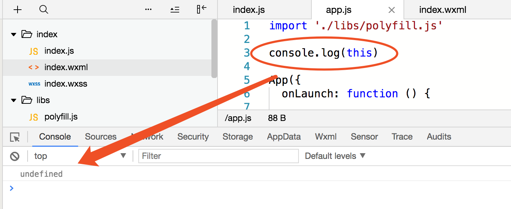
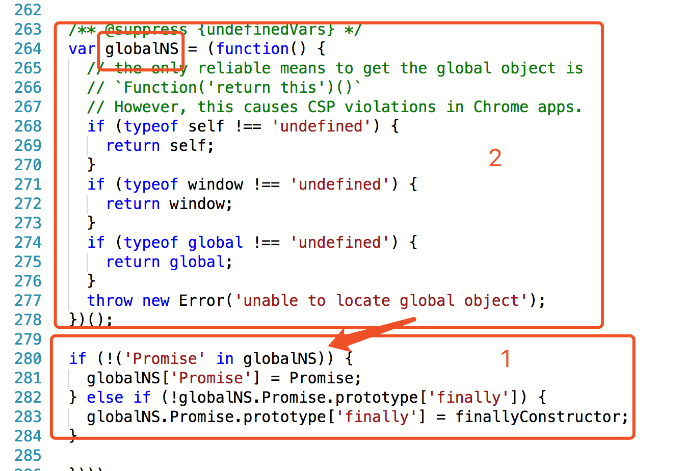
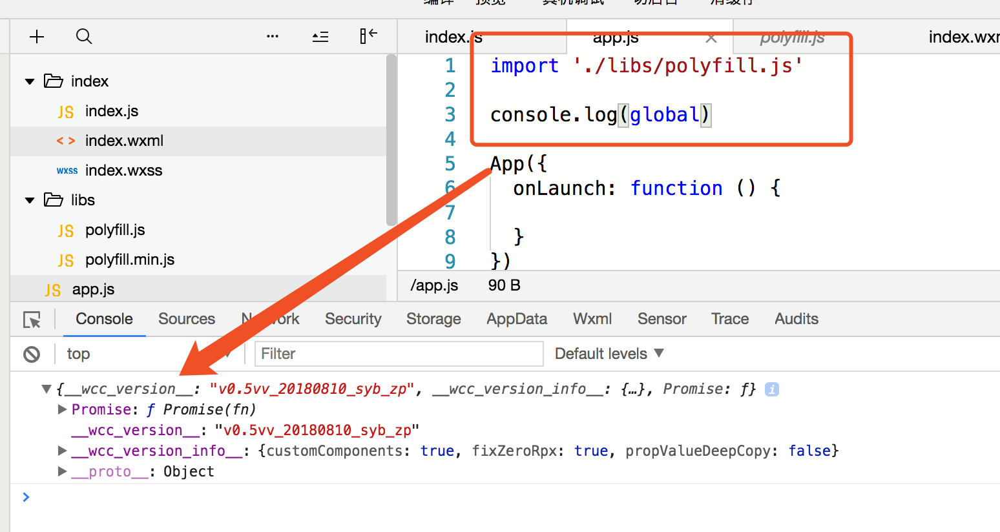
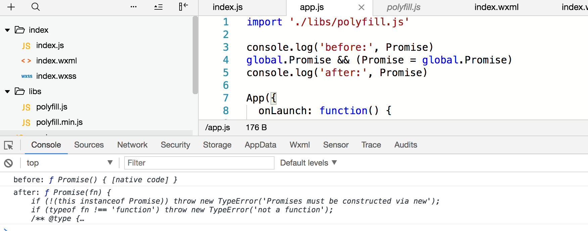

# 小程序Promise不支持finally解决方案

## 代码片段

点击链接即可在微信开发者工具中查看代码[wechatide://minicode/t2eidemj7P3X](wechatide://minicode/t2eidemj7P3X)

## 基本思路

小程序的Promise是不支持finally方法的，这样有一些操作就不太方便玩了，比如hideLoading，总不能在resolve和reject写两遍吧，这样不优雅。其实稍微有些经验的前端开发工程师都清楚，如果一个东西原生不支持，可以引入他的polyfill库，小程序上也是从这个思路出发的，不过小程序有两个比较坑的地方，就是我们取不到全局变量，换句话说就是直接`console.log(this)`,结果是`undefined`。

<!-- more -->

那我们引用一个Promise库应该如何使用呢？我们不妨来读一下`Promise-polyfill`的源码。

跳过Promise的实现，我们看到他最后是把Promise绑定到全局对象上，就是图中的`globalNS`，那么我们只要找到globalNS代表什么就知道Promise在哪了，可以看到他依次判断`self`、`window`、`global`。通过我们的实践发现，前面两个还真的是`undefined`，那么我们可以肯定`Promise`在`global`对象上，最后输出看了一下，还真是。

找到了Promise实际上这一步就可以用它了，但是还是比较麻烦，因为如果用引用的第三方库的Promise需要加global前缀，不加的话还是原生的，我们可以直接用赋值号干掉原生的Promise。

大功告成，至此可以放心大胆的使用Promise规范支持的各个功能了，还可以根据自己的需求修改Promise的实现来定制功能。

## 思考

为何小程序直接`console.log(this)`为`undefined`？注意此时的this是最外层的this，不是Page里面的this更不是Component里面的this，这个问题我也不是特别清楚，虽然在js文件中无法输出window对象，但是如果直接在控制台输入window是可以的，并且我们修改Promise之后，window.Promise也变成修改后的值了，所以我猜想，window对象还是存在的，但是微信把他隐藏起来了，以至于我们只能访问window下面的属性，由此也导致，全局this也是undefined并不是global。当然这只是一个猜想，如果有其他想法也欢迎和我讨论。

## 延伸

关于Promise兼容问题还是比较好解决的，不过Promise的实现可以手撕一下，不到200行的代码量能学到很多东西。
