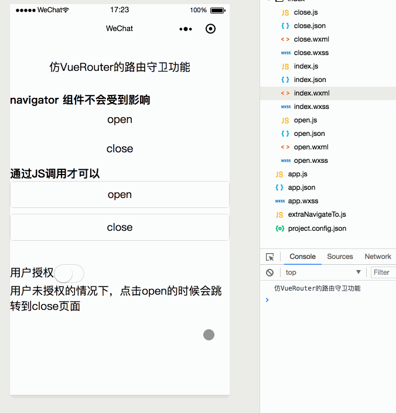

# 仿VueRouter写小程序的路由守卫

小程序代码片段: [wechatide://minicode/80h6lemI7c3Y](wechatide://minicode/80h6lemI7c3Y)

## 涉及到的知识点

**getCurrentPages()**、**Object.defineProperty()**

## 基本描述

本功能可以让小程序开发者有对路由跳转进行控制的能力，跳转前可以做一些判断，比如用户的授权信息之类的（具体看业务需求），在跳转后可能主要是一些日志或埋点工作（具体看业务需求）

<!-- more -->

## 效果图

又到了激动人心的无图言diao环节

## 使用方法

代码可以直接打开上面的代码片段看到，下面是使用路由守卫的代码

	// app.js
	// 引用这个方法来修改原生的navigateTo
	import extraNavigateTo from './extraNavigateTo.js'
	
	// 根据自己的需求定义before方法
	const before = function(from, to, next) {
	  if (to.path === '/index/open' && !wx.getStorageSync('auth')) {
	    next({
	      url: '/index/close'
	    })
	  } else {
	    // 要显示调用next()方法
	    next()
	  }
	}
	
	// 根据自己的需求定义after方法
	const after = function(path) {
	  console.log('after', path)
	}
	
	App({
	  onLaunch: function() {
	    // 测试用
	    wx.setStorageSync('auth', false)
	
	    // 修改navigateTo
	    extraNavigateTo(before, after)
	  }
	})
	
通过看代码可以发现只要在小程序的`onLaunch`生命周期中执行`extraNavigateTo(before, after)`这个语句就行了，具体解释下before和after的入参

before:Function

名字 | 类型 | 说明
---- | --- | ---
from | string | 路由跳转调用的页面路径
to | object | 里面有三个字段 `fullPath,path,query`顾名思义（我就懒得解释了😂）
next | function | 当用户调用next之后，就相当与重定向，next接受的参数和wx.navigateTo入参一致

after:Function

名字 | 类型 | 说明
---- | --- | ---
path | string | 路由跳转后的页面路径

## 实现原理

实现的核心代码就是在`extraNavigateTo.js`文件中，主要是通过`Object.defineProperty`方法对`wx`对象的`navigateTo`方法重写（因为直接赋值是不成功的:`wx.navigateTo = function(){}`）

另外`getCurrentPage`也是一个很好用的方法，注意这个是没有wx后缀的，说明小程序还是有全局变量且这个全局变量还包括`wx`,`getCurrentPage`方法在小程序文档中也介绍的很清楚是可以获取当前页面栈的，通过页面栈还可以拿到任何一个活动页面的上下文，所以可以发挥想象力搞一些骚操作，感兴趣的同学可以`console`试试

## 不足

- 由于是对wx.navigateTo的改写，所以如果是用`navigate`组件则不生效
- 这个虽然是仿vue-router，不过其实很不一样，毕竟vue-router是监听url，这个只是在调用前做一些东西

## 最后

如果关于此功能或者其他关于小程序的疑问，欢迎和我交流讨论 [ljybill@aliyun.com](ljybill@aliyun.com)
